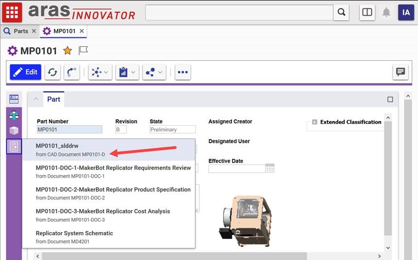

# PDF Viewer Menu Label 

In v11 of Aras Innovator, PDF viewer labels included where the PDF was from. While this is not normally present in v12, this project restores the information.

## Project Details

Release | Notes
--------|--------
[v1.0](https://github.com/ArasLabs/pdf-viewer-menu-label-change/releases/tag/v1.0) | First release. Built and tested on Aras Innovator 12 SP15.

#### Supported Aras Versions

Project | Aras
--------|------
[v1.0](https://github.com/ArasLabs/pdf-viewer-menu-label-change/releases/tag/v1.0) | 12.0 SP1

## Installation

#### Important!
**Always back up your code tree and database before applying an import package or code tree patch!**

### Pre-requisites

1. Aras Innovator installed

### Install Steps

1. Backup your code tree and store the archive in a safe place
2. Navigate to your local `..\PDFViewerMenuLabel\` folder
3. Copy the `\Innovator\` folder
4. Paste this at the root of your install directory
+ By default this is `C:\Program Files\Aras\Innovator\`

## Usage

1. Login to Aras Innovator
2. Navigate to Design > Parts in the table of contents (TOC) and click Search.
3. Right click on a Part item in the main grid and select Open.
4. In the sidebar on the left, look for the PDF viewer. Left click it.
5. You should see the origins of the PDFs in smaller text beneath the titles.

When done, your display will look something like this:

## Contributing

1. Fork it!
2. Create your feature branch: `git checkout -b my-new-feature`
3. Commit your changes: `git commit -am 'Add some feature'`
4. Push to the branch: `git push origin my-new-feature`
5. Submit a pull request

For more information on contributing to this project, another Aras Labs project, or any Aras Community project, shoot us an email at araslabs@aras.com.

## Credits

Original Aras community project written by Eli Donahue at Aras Corp.

Documented and published by Skyler Crossman for Aras Labs. @skycrossman

## License

This project is published to Github under the MIT license. See the [LICENSE file](./LICENSE.md) for license rights and limitations.